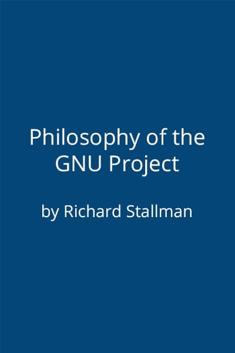

# 开源阅读列表

本阅读列表大名鼎鼎的 [TODO Group](http://todogroup.org/) 社区针对开源办公室相关人员所强烈推荐的图书列表。

英文原版：[New Frontiers in Open Innovation](https://www.amazon.com/Frontiers-Open-Innovation-Henry-Chesbrough/dp/0198803990/ref=sr_1_cc_1?s=aps&ie=UTF8&qid=1507753139&sr=1-1-catcorr&keywords=New+Frontiers+in+open+innovation), OUP Oxford, Henry William Chesbrough 著 (2014）

中文版：[开放式创新:创新方法论之新语境](https://www.amazon.cn/dp/B01IOI0NNI/ref=sr_1_2?ie=UTF8&qid=1536762221&sr=8-2&keywords=New+Frontiers+in+Open+Innovation),复旦大学出版社,亨利·切萨布鲁夫(Henry (作者), Chesbrough) (作者), 维姆·范哈弗贝克(Wim (作者), Vanhaverbeke) (作者), 乔·韦斯特(Joel (作者), West)等 ,第1版 (2016年6月1日)

关于企业界开放式创新的研究课题新的发现和思考。

开放式创新是一种新出现的管理范式，强调在创新过程中，运用超越企业边界的内外部知识来引入新事物。在理解和从事开放式创新过程中，我们会面对各种各样的困惑，如公司怎样才能走出传统的知识封锁，超越其组织管理的边界？企业怎样才能敞开吸收来自外部的知识？企业怎样才能向外部提供对方需要的知识？

英文版：[The Open Organization: Igniting Passion and Performance](https://hbr.org/product/the-open-organization-igniting-passion-and-performance/13980-HBK-ENG), Harvard Business Review 出版社,  Jim Whitehurst 著 (2015)

中文版：[开放式组织](https://www.amazon.cn/dp/B01LW40QLD/ref=sr_1_1?ie=UTF8&qid=1536849012&sr=8-1&keywords=The+Open+Organization),机械工业出版社; 第1版 (2016年9月8日),Jim Whitehurst (作者), 王洋 (译者)

在《开放式组织》中，开放源代码的巨人——红帽公司的总裁和CEO -- 吉姆·怀特赫斯特根据他在开源领域的亲身经历，绘出了一份领导力的蓝图。通过真实记录他从传统经理人转变为 “首席问题解决者”的过程，吉姆清晰地展示了如何让员工、合作伙伴和客户热情高涨地参与到社区当中，如何借此点燃大家的热情、鼓励创新，从而在真正的开放、合作和共同使命的基础上，将现代企业带向成功。
《开放式组织》写给大公司、小公司、成熟型公司、艰难成长的创业型公司的领导者和期待成为领导者的人们，展示如何打造一个新型的开放式组织模式，获得当今企业必须具备的速度和灵活性。

以下内容是著名社区opensource.com根据 **开放式组织** 专门写的几个系列，以小书的形式发布，目前有5本，可以自由浏览。汇总地址：[开放式组织小书系列](https://opensource.com/open-organization/resources/book-series)，以下分别介绍：

英文版：[The Open Organization Field Guide](https://opensource.com/open-organization/resources/field-guide)

此书直译为中文是：《开放组织领域指南》，是社区根据Jim Whitehurst 关于未来的工作、管理和领导力的构思加工而成。该书收集了一些非常先进的理念，有关开源之道的价值如何改变我们的工作、管理和领导力。

英文版：[The Open Organization Leaders Manual](https://opensource.com/open-organization/resources/leaders-manual)

此书直译为中文是： 《开放组织领导者参考》，是任何想要利用开放的力量的参考手册，让自己的团队更加的透明、灵活、而且良好的协作，能够达到自下而上的任务驱动。

英文版：[The Open Organization Guide to IT Culture Change
](https://opensource.com/open-organization/resources/culture-change)

此书直译为中文是：《转变为开放组织的文化变更指南》，顾名思义，即关于文化的变更，该书的贡献者有超过25名来自开源社区、公司企业，该书提供了这些资深人士的切身经验和实用建议，为创造一个开放的IT部分提供良好的、能够快速得到好的结果的、无与伦比的业务价值。

英文版：[The Open Organization Workbook
](https://opensource.com/open-organization/resources/workbook)

此书直译为中文是：《开放组织工作手记》，该书的编写汇集了30多位专家的真知灼见，他们的角色有企业管理者、教育工作者、技术大拿、咨询师、等等。该书提供了将透明度，包容性，适应性，协作和社区原则付诸实践的具体和可行的战略。

英文版：[Organize for Innovation](https://opensource.com/open-organization/resources/organize-innovation)

此书直译为中文是：《组织的创新》或《创新的组织》，红帽主席和CEO Jim Whitehurst 的集达成之作，其对于技术、社会、经济等力量如何影响我们的日常工作进行了反思，指出了解决目前企业遇到的难题的办法，那就是通过新的组织哲学、模式以及更具动态的方式来解决。Whitehurst 诠释了公司上下任何人都可以是领导者，这样可以让我们重新思考该如何利用数据、多去尝试失败、团队的架构、以及迅速设定目标等等，简而言之：如果让公司所有人变得更具创造力。

英文版：[Open Innovation: The New Imperative for Creating And Profiting from Technology](https://www.amazon.com/Open-Innovation-Imperative-Profiting-Technology/dp/1422102831), Harvard Business School Press, by Henry Chesbrough (2005)

开放式创新的提出者——Henry Chesbrough 的奠基之作，从学术的角度来探讨为何以及为什么 IT 公司能够通过积极的协作进行有效的创新。

英文版：[Open Business Models: How to Thrive in the New Innovation Landscape](https://hbr.org/product/open-business-models-how-to-thrive-in-the-new-inno/an/4273-HBK-ENG), Harvard Business School Press, by Henry Chesbrough (2006)

中文版：[开放型商业模式:如何在新环境下获取更大的收益](https://www.amazon.cn/dp/B004HKJHWQ/ref=sr_1_fkmr0_1?ie=UTF8&qid=1536763671&sr=8-1-fkmr0&keywords=Open+Business+Models%3A+How+to+Thrive+in+the+New+Innovation+Landscape%2C+Harvard+Business+School+Press)商务印书馆;亨利·伽斯柏 (作者), 张继松 (合著者), 程智慧 (译者);第1版 (2010年11月1日)

商业领导人必须采纳一种全新的开放型商业模式。在运用这些模式时，除了紧盯住那些能给公司带来效益的创意、知识产权以及未被其他公司采用的专利外，公司的目光还必须向外扩展。

创意无处不在，人人都可以从中发现和获得价值，你准备好了吗？

由于有用的知识已不再集中于少数几个大的组织机构手里，因此作者在在《开放型商业模式:如何在新环境下获取更大的收益》中，作者诠释了“如何在开放的创新环境中赢利”。他提出，为了使创新更为开放，公司不得不运用多种方式管理知识产权。另外，他给出了一个评估公司目前商业模式的模型，同时阐明了在创建开放型模式中如何克服常见的困难。

作者也研究了有效的知识产权保护带给创新中间市场的冲击。他介绍了一种新角色——促进公司有权使用国外技术的创新协调人。同时，他也描绘了那些将商业模型重点放在创新和知识产权保护上的公司的概况。书中采用大量事例展示了那些采用开放型商业模式的公司的优势，包括旧M、宝洁和Air Products等公司。这些事例的研究结果可为那些苦觅开放型商业模式的组织机构提供有益的借鉴，其中包括：

* 如何获得开拓新的收入来源的经验
* 运用这些方法衡量公司是否在更开放的道路上前进
* 在公司和客户内部逐步扩大开放型商业模式应用范围的战略

这些重要的资源可为经理人提供大量的将创新和知识产权管理联系起来的路线图。通过有效地掌握开放型商业模式，公司可从创意和技术中发现和获得价值。

英文版：[Wikinomics: How Mass Collaboration Changes Everything](https://www.amazon.com/dp/B000QBYEH8/ref=dp-kindle-redirect?_encoding=UTF8&btkr=1)， Don Tapscott 和 Anthony D. Williams合著(2006)

中文版：[维基经济学:大规模协作如何改变一切(白金版)](https://www.amazon.cn/dp/B006GKSTJC/ref=sr_1_1?ie=UTF8&qid=1536848199&sr=8-1&keywords=%E7%BB%B4%E5%9F%BA%E7%BB%8F%E6%B5%8E%E5%AD%A6),唐•泰普斯科特(Don Tapscott) (作者), 安东尼•D.威廉姆斯(Anthony D.Williams) (作者),中国青年出版社; 第2版 (2012年1月1日)

维基经济学的得名，缘于维基百科全书网站的巨大成功，它向世界证明：如果有一种方法充分利用组织里每一个人的智慧，它的能量将无比惊人！维基经济学所揭示的四个新法则——开放、对等、共享以及全球运作——正在取代一些旧的商业教条，许多成熟的传统公司正在从这种新的商务范式中受益。我们所熟知的企业如Google、亚马逊、宝洁、IBM、乐高、英特尔、宝马、波音、百思买、Youtube、MySpace等，都已经从维基经济中获得巨大的成功。

《维基经济学》的结论源自900万美元的研究项目，素有“数字经济之父”美誉的新经济学家唐•泰普斯科特向我们展示了个体力量的上升是如何改变商业社会的传统规则。

这种利用大规模协作生产产品和提供服务的新方式，正颠覆我们对于传统知识创造模式的认识。面对变化激烈的未来，企业和个人必须更有远见，掌握维基技术，拥抱维基理念，是21世纪最重要的商业素质。

英文版：[The Cathedral and the Bazaar: Musings on Linux and Open Source by an Accidental Revolutionary](http://shop.oreilly.com/product/9780596001087.do), O’Reilly Media, Eric Raymond 著 (1999)

中文版：[大教堂与集市](https://book.douban.com/subject/25881855/),机械工业出版社，Eric Raymond 著，译者: 卫剑钒 （2014-5）

当代软件技术领域最重要的著作！

《大教堂与集市》是开源运动的《圣经》，颠覆了传统的软件开发思路，影响了整个软件开发领域。作者Eric S. Raymond是开源运动的旗手、黑客文化第一理论家，他讲述了开源运动中惊心动魄的故事，提出了大量充满智慧的观念和经过检验的知识，给所有软件开发人员带来启迪。本书囊括了作者最著名的“五部曲”，并经过作者的全面更新，增加了大量注释，提高了可读性，是经典收藏。

开源运动对软件业和互联网带来了巨大影响，本书作为开源运动的独立宣言，其影响力远远超出编程领域，如果想在互联网时代做生意，这本书是必读经典。

英文版：[The Magic Cauldron](http://www.catb.org/esr/writings/magic-cauldron/)， Eric Raymond 著(1999)

此文章的中文版已经纳入[大教堂与集市](https://book.douban.com/subject/25881855/)，有关开源的经济学内容。

英文版：[Philosophy of the GNU Project](https://www.gnu.org/philosophy/philosophy.html),  Richard Stallman 著

中文版：[GNU 工程的哲学](https://www.gnu.org/philosophy/philosophy.zh-cn.html),翻译：李凡希，2010。

无论同意与否，这是开源软件的起源的地方，理解Stallman先生的远见一定有助于你更加深刻的理解开源。

英文版: [Producing Open Source Software：How to Run a Successful Free Software Project](http://producingoss.com/en/index.html)， O’Reilly Media,  Karl Fogel 著 (2018)

中文版：[制造开源软件:如何成功运营自由软件项目](https://producingoss.com/zh),基于CreativeCommons Attribution-ShareAlike (3.0) 许可协议，Karl Fogel 著

如何成功运营项目的向导指南，无论你是用户还是开发者，本书都可以满足你的期望，当然本书还包括了自由软件文化的介绍。

英文版：[Open Sources 2.0](http://shop.oreilly.com/product/9780596008024.do): The Continuing Evolution, O’Reilly Media,  Chris DiBona, Mark Stone, Danese Cooper 等著

书名翻译：**开源2.0：持续进化**

这是《开源：来自开源革命的声音》姊妹篇，是深刻被开源所驱动的业界代表们的文章合集，这些被选中的代表均是大家所耳能生详的开源界活跃大拿，有的是来自企业的开源经理，有的是开源布道师。精彩纷呈，不容错过。

英文版：[The New Kingmakers：How Developers Conquered the World](https://www.amazon.com/New-Kingmakers-Developers-Conquered-World-ebook/dp/B0097E4MEU), O’Reilly Media, Stephen O'Grady 著(2013)

如果你对当前技术决策一切的时代下如何理解开发者这个角色，此书绝对不能错过。

英文版：[The Software Paradox：商业软件市场的崛起与陨落](https://www.amazon.com/Software-Paradox-Rise-Commercial-Market/dp/1491900938), O’Reilly Media, Stephen O’Grady 著(2015)

来自 RedMonk 的分析，学习下为何商业软件市场已经改变。

英文版：[The Art of Community: Building the New Age of Participation](https://www.amazon.com/Art-Community-Building-New-Participation/dp/1449312063), O’Reilly Media, Jono Bacon 著 (2012)

中文版：[社区运营的艺术（第2版）](https://book.douban.com/subject/26976995/)，电子工业出版社，Jono Bacon 著 ，译者: 段泽军 / 陈宴 （2017-2）

由全球最大开源社区Ubuntu社区前社区经理 Jono Bacon的执笔，社区运营的圣经级书籍，本文是如何创建和运营开源社区的向导。

英文版：[Open Sources: Voices from the Open Source Revolution](http://www.oreilly.com/openbook/opensources/book/index.html), O’Reilly Media, by Eric S. Raymond (1999)

中文版：[开源软件文集:开源革命之声](https://book.douban.com/subject/1236778/),译者:  洪峰 ,中国电力出版社 (1999)

开源早期的领导者们的文章合集，其中不乏大名鼎鼎的人物。

**开源之道重点推荐图书**

英文版：[Codev2](http://codev2.cc/),  Larry Lessig 著 (2005)

购买纸质版：[Code: And Other Laws of Cyberspace, Version 2.0 ](https://www.amazon.com/gp/product/0465039146?ie=UTF8&tag=codev2-20&linkCode=as2&camp=1789&creative=9325&creativeASIN=0465039146)

关于互联网监管的经典论文以及代码作为一种法律形式的作用。

> 该书可以免费下载，遵循[Creative Commons Attribution-ShareAlike 2.5 License](http://creativecommons.org/licenses/by-sa/2.5/)。

英文版：[Open Source for Business: A Practical Guide to Open Source Software Licensing, 2nd Edition](http://www.pdffull.co/files/book.php?id=1544737645) ， Heather Meeker 著

欲理解开源软件许可证，必读书之一。

英文版：[The Open Source Alternative](https://www.amazon.com/Open-Source-Alternative-Understanding-Opportunities/dp/0470194952/ref=pd_sim_14_2?_encoding=UTF8&psc=1&refRID=TRNY5HWZJ8WXZJFPW2A1), Wiley, Heather Meeker 著(2008)

该书算是一本用户手册，旨在让人们去了解企业使用开源软件是的开源许可证问题。

英文版：[The Success of Open Source](https://www.amazon.com/dp/B002OSXS0U/ref=dp-kindle-redirect?_encoding=UTF8&btkr=1), Steven Weber 著，Harvard University Press (2005年10月4日)

非常适合从局外人的角度理解开源的重要性。

[Intellectual Property and Open Source](https://www.amazon.cn/dp/0596517963/ref=sr_1_1?ie=UTF8&qid=1536763039&sr=8-1&keywords=Intellectual-Property-Open-Source-Protecting)， O'Reilly Media, Inc,，Van Lindberg 著， (2008年7月29日)

该书通过工程师的视角来看待开源的许可协议，没有基于律师的视野也是令人陶醉的决定。既然是给“外行人”看的，那么就会涉及到一点关于相关法律的历史介绍，诸如为什么我们需要商标？为什么我们需要版权所有？等等。

英文版：[Managing 3rd-Party Software Licenses,](https://www.amazon.com/Managing-3rd-Party-Software-Licences-ebook/dp/B01JJC7LD8) 自助出版， Giles Middleton 著(2016)

书名翻译：**管理第三方软件许可：完全掌控协议利益**

该书涵盖了很多内容，当然内容是适合哪种快速浏览的。

英文版：[The International Free and Open Source Software Law Book](http://ifosslawbook.org/), 开源出版, Ywein Van den Brande, Shane Coughlan, 和 Till Jaeger 合著(2014)

关于自由和开源软件法律在不同国家的影响，这是一本非常引人入胜的读物。卓越律师合著。
